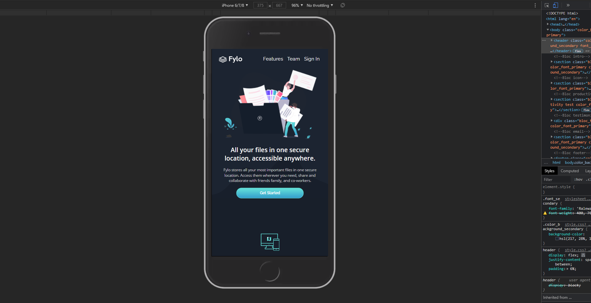
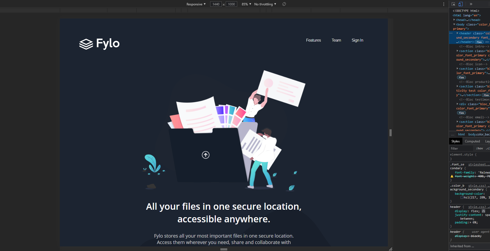

# Frontend Mentor - Fylo dark theme landing page solution

This is a solution to the [Fylo dark theme landing page challenge on Frontend Mentor](https://www.frontendmentor.io/challenges/fylo-dark-theme-landing-page-5ca5f2d21e82137ec91a50fd). Frontend Mentor challenges help you improve your coding skills by building realistic projects. 

## Table of contents

- [Overview](#overview)
  - [The challenge](#the-challenge)
  - [Screenshot](#screenshot)
  - [Links](#links)
- [My process](#my-process)
  - [Built with](#built-with)
- [Author](#author)

## Overview

### The challenge

- Build out the project to the designs provided

### Screenshot

### Links

- Solution URL: [Solution github](https://github.com/jordanlaurent/fylo-dark-theme-landing-page-master)
- Live Site URL: [Solution live site URL](https://jordanlaurent.github.io/fylo-dark-theme-landing-page-master/)

## My process

### Built with

- Semantic HTML markup
- CSS custom properties
- Flexbox
- CSS Grid
- Mobile-first workflow

## Author

- Website - [portfolio](https://www.jordan-laurent.fr)
- Frontend Mentor - [@jordanlaurent](https://www.frontendmentor.io/profile/jordanlaurent)
- Linkdin - [@yourusername](https://www.linkedin.com/in/laurent-jordan/)
